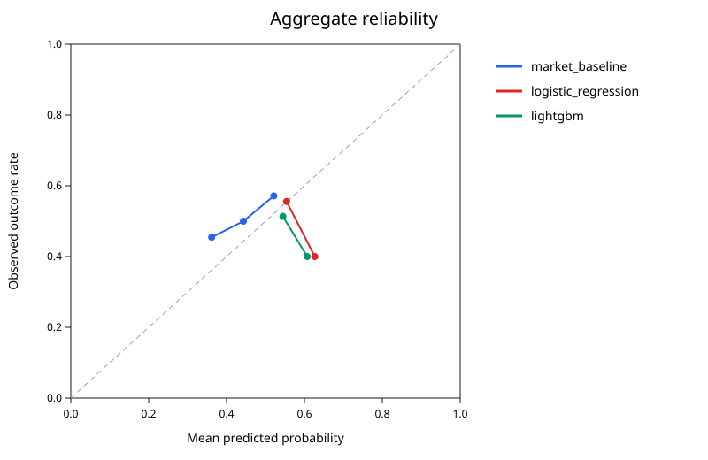

# Bellwether

Bellwether is a small research system for asking whether onchain prediction-market data can support useful forecasts. It follows one fixture contract on Base, keeps a canonical event history through shallow reorgs, computes point-in-time features in Go, and evaluates simple models with an embargoed walk-forward harness in Python.

It is a data project, not a trading bot. The included Solidity contracts are no-value Base Sepolia fixtures, not a real exchange or settlement system.

## What is here

- a Go indexer with bounded HTTP backfill, live WebSocket ingestion, finality tracking, and reorg recovery
- one Go feature engine used for both streaming snapshots and canonical batch replay
- deterministic labeled Parquet export with a content-derived dataset ID
- a Python experiment command for logistic regression, LightGBM, Brier score, log loss, and calibration
- in-process LightGBM inference in Go
- small Base Sepolia market and commit-reveal fixtures

## Run it locally

You need Go 1.23+, Python 3.12+, and [uv](https://docs.astral.sh/uv/). The commands below are PowerShell and start at the repository root.

1. Run the Go and Python checks. `uv` creates the Python environment from the lockfile on first use.

   ```powershell
   python scripts/dev.py check
   ```

2. Generate the deterministic synthetic dataset. The command writes 72 labeled rows from 24 fixture markets and prints its logical dataset ID.

   ```powershell
   New-Item -ItemType Directory -Force ./.demo | Out-Null
   go run ./cmd/bellwether-demo --output ./.demo/bellwether-synthetic.parquet
   ```

3. Run the measured experiment. These values reproduce the checked-in artifacts from source revision `7537f79`; use `git rev-parse HEAD` instead for a new run.

   ```powershell
   $datasetId = "bbef230f73b0290fcdc9af41fe10c4732f0e9ee32555e167035392df8eddb175"
   $gitSha = "7537f79"
   Push-Location ./python
   uv run bellwether-experiment --data ../.demo/bellwether-synthetic.parquet --config ../experiment.example.toml --output-dir ../.demo/synthetic-results --git-sha $gitSha --data-snapshot-id $datasetId
   Pop-Location
   ```

4. To follow the Base Sepolia fixture instead, copy `config.example.toml` to `config.toml`, replace its placeholder RPC URLs and contract address, then choose live indexing or a one-shot labeled export.

   ```powershell
   Copy-Item ./config.example.toml ./config.toml
   # Edit config.toml, then run one of:
   go run ./cmd/bellwether --config ./config.toml
   go run ./cmd/bellwether --config ./config.toml --export-training-data ./training.parquet
   ```

The repository contains a [Base Sepolia deployment walkthrough](docs/base-sepolia-demo.md), including a dry run and explicit wallet-approved broadcast. Submitted deployments can be inspected on the [Base Sepolia explorer](https://sepolia-explorer.base.org). No key or seed belongs in this repository.

## Architecture

```text
Base RPC / WebSocket
        |
        v
  bounded backfill + live heads
        |
        v
  reorg coordinator ---> canonical Go chain store
                              |
                              v
                       Go feature engine
                       /               \
                      v                 v
              live snapshots     labeled Parquet
                                        |
                                        v
                             Python walk-forward run
                          metrics + calibration + model
                                        |
                                        v
                               Go model inference
```

Go is the only feature-computation implementation. Python consumes the labeled Parquet; it does not recreate features. Each run records the source SHA, canonical config hash, and dataset snapshot ID.

## Reorg guarantee

Every stored block retains its hash and parent hash. When a new head does not build on the current tip, the coordinator finds the common ancestor, rolls back the orphaned branch, and replays the replacement branch. A reorg is accepted only while its ancestor is retained and above the finalized checkpoint. Otherwise Bellwether returns `ErrResyncRequired` without partially changing state.

The core invariant is tested directly: state after an injected reorg must be byte-for-byte identical to a clean replay of the final canonical chain. Reprocessing the same sealed range is also a no-op. Unfinalized rows may still be replaced; finalized history may not.

## Measured synthetic demo

These are measurements from the deterministic fixture run at `7537f79`, using `experiment.example.toml`: 72 rows, 24 synthetic markets, seven walk-forward folds, seed 7, and a six-row embargo. Lower scores are better.

| Predictor | Brier score | Log loss |
| --- | ---: | ---: |
| Market-implied baseline | 0.252517 | 0.698396 |
| Logistic regression | 0.262437 | 0.718862 |
| LightGBM | 0.255911 | 0.705190 |

The baseline was best on both metrics in this run. More importantly, these numbers are from tiny, constructed, balanced fixture markets. They do not show that any model beats a real market and should not be read as evidence of real forecasting performance. They only prove that canonical replay, feature export, walk-forward evaluation, artifact generation, and model export run end to end.

Run identity:

- source: `7537f79`
- dataset: `bbef230f73b0290fcdc9af41fe10c4732f0e9ee32555e167035392df8eddb175`
- config: `db9684c874fcc030aa0d75cdf1e16fd88dd2b0bffd02dea512c62b7ef4667371`
- full metrics: [`artifacts/synthetic-demo/metrics.json`](artifacts/synthetic-demo/metrics.json)



## Inference benchmark

Five fresh samples from `go test ./internal/inference -run '^$' -bench '^BenchmarkModelPredict$' -benchmem -count=5` on Go 1.23.5, Windows/amd64, AMD Ryzen 5 8645HS:

| Sample | ns/op | B/op | allocs/op |
| ---: | ---: | ---: | ---: |
| 1 | 2,383 | 64 | 3 |
| 2 | 2,389 | 64 | 3 |
| 3 | 2,725 | 64 | 3 |
| 4 | 2,952 | 64 | 3 |
| 5 | 2,856 | 64 | 3 |

These are local microbenchmark observations, not a latency guarantee.

## Checks observed locally

| Suite | Result |
| --- | --- |
| Go | 183 top-level tests passed across 12 packages; 430 pass events including subtests |
| Python | 56 passed |
| Solidity | not counted locally because `forge` was unavailable; CI installs pinned Foundry and runs `forge test` |

CI also runs Go vet, formatting and lint checks, Go race tests, and the Solidity suite.

## Known limits

- The indexed ABI and contracts are Bellwether integration fixtures, not an official Coinbase, Kalshi, or other market integration.
- State is in memory. A process restart requires a backfill, and a reorg beyond the retained depth requires a resync from finalized state.
- Backfill speed and live availability depend on the configured RPC provider. The public Base Sepolia RPC can throttle requests.
- The current scope is one chain, one contract, five onchain features, and two model families.
- The checked-in results use synthetic data. Real evaluation needs representative resolved markets, realistic timestamps and liquidity, data-quality review, and out-of-sample monitoring.
- The no-value testnet contracts have not been audited and are not intended for mainnet or custody.
